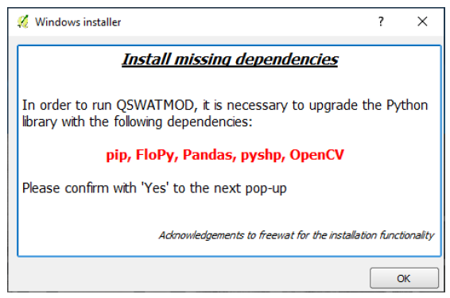

#  &nbsp; QSWATMOD
##### 
***Note:*** We're planning to migrate QSWATMOD from QGIS2 to QGIS3 version soon and implement all dependencies.
 
[QSWATMOD](https://swat.tamu.edu/software/swat-modflow/) is a QGIS-based graphical user interface that facilitates linking SWAT and MODFLOW, running SWAT-MODFLOW simulations, and viewing results.  
This repository contains materials for the QSWATMOD tutorial.  
- **[Installer](https://github.com/spark-brc/qswatmod/tree/master/Installer):** 
- **[Inputs](https://github.com/spark-brc/qswatmod/tree/master/Inputs):**
- **[Source Code](https://github.com/spark-brc/qswatmod/tree/master/SourceCode):**
    
-----
# Installation
The QGIS software must be installed on the system prior to the installation of QSWATMOD. We recommend installing the latest “long term release (LTR)” version of QGIS (2.18.21 ~ 2.18.27)

- Install QGIS by running QGIS-OSGeo4W-2.18.27-1-Setup-x86_64.exe. It can be downloaded from http://download.osgeo.org/qgis/win64/QGIS-OSGeo4W-2.18.27-1-Setup-x86_64.exe.
- Download [the QSWATMOD installer](https://github.com/spark-brc/qswatmod/tree/master/Installer) and install it by running QSWATMOD 1.2.exe or a later version. The QSWATMOD is installed into the user's home directory *(~/.qgis2/python/plugins/QSWATMOD)*, which we will refer to as the QSWATMOD plugin directory.

    

QSWATMOD has dependencies to third-party Python packages including FloPy3, Pandas, OpenCV, and pyshp. These packages will be installed automatically in the designated Python environment after QSWATMOD is activated in QGIS.
- Open QGIS after the installation of QSWATMOD is finished.
- Click the “Yes” button to install the dependencies.

    

- After all the dependencies are installed, click the “OK” button. It will reopen QGIS automatically.

    

In addition, [documentation and the SWAT-MODFLOW executable](https://swat.tamu.edu/software/swat-modflow/) are available as downloads. QSWATMOD and SWAT-MODFLOW have been tested in several watersheds. However, no warranty is given that either the model or tool is completely error-free. If you encounter problems with the model or have suggestions for improvement, please comment at [the SWAT-MODFLOW Google group](https://groups.google.com/forum/?hl=en#!forum/swat-modflow) or [QSWATMOD github](https://github.com/spark-brc/qswatmod/issues).